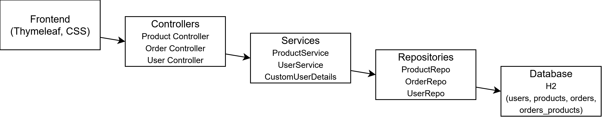

# 

# Book Store
**Liam Matheson, Colton Trainor**

---

## Description

- A simple Spring Boot web application for managing a small online bookstore. Users can browse products, view details, and add items to a cart. The project includes controllers, services, repositories, and a basic frontend using Thymeleaf. Authentication is handled with Spring Security, and the application follows an MVC structure. The goal is to demonstrate full-stack development with Spring Boot, JPA, and a functional product catalog.

---

## Features

- Register for an account
- Log in and access your profile
- View available products or books
- Add items to a basket
- Review items in the basket
- Complete a checkout process
- JPA ORM with Entities and Repositories

---

## Screenshots

---

## Diagrams

# Entity Relationship Diagram

# Architecture Diagram

---

## Team Roles

- Liam - 3.1 User Registration and Login, 3.2 Book Catalog. Github, CSS.
- Colton - 3.3 Basket Functionality, 3.4 Checkout, Diagrams

---

## Installation Steps

- Clone the repository and navigate into it:

- git clone https://github.com/liammatheson/Liam-Colton-INET-Final-Project-Book-Store.git
- cd Liam-Colton-INET-Final-Project-Book-Store

- Make sure you have Java JDK 17 or higher and Maven installed. Build the project with mvn clean install. Once the build completes, start the application using mvnw spring-boot:run. The application will then be accessible at http://localhost:8080.

- You can also open the project in your preferred IDE (VS Code, Eclipse, IntelliJ) as a Maven project for easier editing and running.

## References

All book information, including descriptions and images, is sourced from [Project Gutenberg](https://www.gutenberg.org/).

This project was developed using official Spring documentation, in-class materials from NSCC, and general Java/Spring Boot resources for guidance. No external code was copied; references were used only for learning and clarification of concepts.

